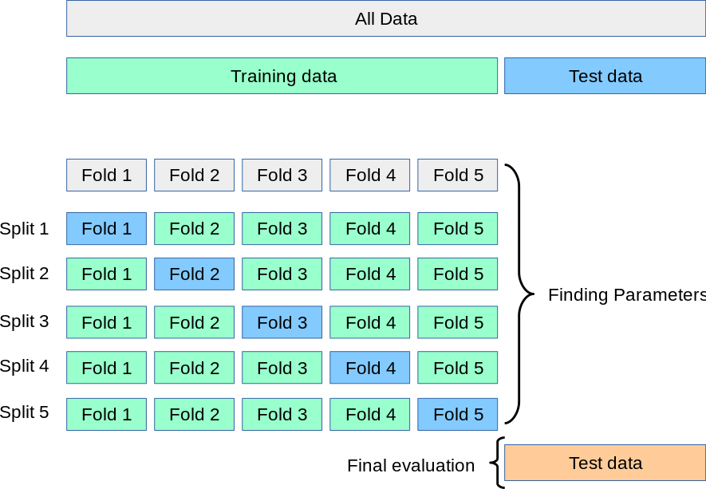

# Technical Report

This document elaborately demonstrates the process of data analysis and learning carried out in order to train an
optimal model.

## Read the data
The total number of data points in the dataset are 961.
But there are missing values in the dataset and the rows corresponding to the missing values
are removed. Thus the cleaned data has 830 rows.


```python
import pandas as pd
import numpy as np

data = pd.read_csv('data.csv')
print('Number of rows before removing missing values: %d' % data.shape[0])
# Remove rows containing missing values.
cleanData = data.replace('?', np.nan).dropna().reset_index(drop=True)
cleanData = cleanData.astype('float64')


cleanData.describe()
```

    Number of rows before removing missing values: 961


<div>
<style scoped>
    .dataframe tbody tr th:only-of-type {
        vertical-align: middle;
    }

    .dataframe tbody tr th {
        vertical-align: top;
    }

    .dataframe thead th {
        text-align: right;
    }
</style>
<table border="1" class="dataframe">
  <thead>
    <tr style="text-align: right;">
      <th></th>
      <th>BIRADS</th>
      <th>Age</th>
      <th>Shape</th>
      <th>Margin</th>
      <th>Density</th>
      <th>Severity</th>
    </tr>
  </thead>
  <tbody>
    <tr>
      <th>count</th>
      <td>830.000000</td>
      <td>830.000000</td>
      <td>830.000000</td>
      <td>830.000000</td>
      <td>830.000000</td>
      <td>830.000000</td>
    </tr>
    <tr>
      <th>mean</th>
      <td>4.393976</td>
      <td>55.781928</td>
      <td>2.781928</td>
      <td>2.813253</td>
      <td>2.915663</td>
      <td>0.485542</td>
    </tr>
    <tr>
      <th>std</th>
      <td>1.888371</td>
      <td>14.671782</td>
      <td>1.242361</td>
      <td>1.567175</td>
      <td>0.350936</td>
      <td>0.500092</td>
    </tr>
    <tr>
      <th>min</th>
      <td>0.000000</td>
      <td>18.000000</td>
      <td>1.000000</td>
      <td>1.000000</td>
      <td>1.000000</td>
      <td>0.000000</td>
    </tr>
    <tr>
      <th>25%</th>
      <td>4.000000</td>
      <td>46.000000</td>
      <td>2.000000</td>
      <td>1.000000</td>
      <td>3.000000</td>
      <td>0.000000</td>
    </tr>
    <tr>
      <th>50%</th>
      <td>4.000000</td>
      <td>57.000000</td>
      <td>3.000000</td>
      <td>3.000000</td>
      <td>3.000000</td>
      <td>0.000000</td>
    </tr>
    <tr>
      <th>75%</th>
      <td>5.000000</td>
      <td>66.000000</td>
      <td>4.000000</td>
      <td>4.000000</td>
      <td>3.000000</td>
      <td>1.000000</td>
    </tr>
    <tr>
      <th>max</th>
      <td>55.000000</td>
      <td>96.000000</td>
      <td>4.000000</td>
      <td>5.000000</td>
      <td>4.000000</td>
      <td>1.000000</td>
    </tr>
  </tbody>
</table>
</div>


Observing the BIRADS column above we can see that the maximum value is displayed as 55. This must
be incorrect as BIRADS values range from 0-5


```python
# Drop row containing BIRADS value as 55 which doesnt make sense.
toDrop = pd.Index(cleanData['BIRADS']).get_loc(55)
cleanData = cleanData.drop(toDrop).reset_index(drop=True)


```

# Data Visualisations


```python
df = pd.DataFrame()
df['Age'] = cleanData['Age']
df['Shape'] = cleanData['Shape'].astype('category').map({1.0:'round', 2.0: 'oval', 3.0:'lobular', 4.0:'irregular'})
df['Margin'] = cleanData['Margin'].astype('category').map({ 1.0: 'circumscribed', 2.0: 'microlobulated', 3.0: 'obscured',4.0: 'ill-defined',5.0: 'spiculated'})
df['BIRADS'] = cleanData['BIRADS'].astype('category')
df['Density'] = cleanData['Density'].astype('category').map({1.0: 'high', 2.0: 'iso', 3.0: 'low', 4.0: 'fat-containing'})
df['Severity'] = cleanData['Severity'].astype('category').map({1.0: 'malignant', 0.0: 'benign'})
df.head()
sns.countplot(x='Shape',hue='Severity',data=df)

```


    <matplotlib.axes._subplots.AxesSubplot at 0x7f3ce10ce320>


**Inference**: 
- A large fraction of the `irregular` (80%) shaped tumours are malignant.
- Most of the `round` and `oval` shaped tumours are benign.
Thus the shape of the tumour is an important feature to be considered.


```python
sns.countplot(x='BIRADS',hue='Severity', data=df)
```


    <matplotlib.axes._subplots.AxesSubplot at 0x7f3ce0f72d30>


**Inference**
- The BIRADS feature is highly skewed with most of the data points concentrated at 4 and 5.


```python
sns.countplot(x='Density', data=df)
```


    <matplotlib.axes._subplots.AxesSubplot at 0x7f3ce10c6240>


**Inference**:
- Most of the density values in the data set are `low`


```python
sns.countplot(x='Margin', hue='Severity', data=df)
```


    <matplotlib.axes._subplots.AxesSubplot at 0x7f3ce0d7a208>


**Inference**:
- Circumscribed masses are likely to be benign
- Spiculated and ill-defined masses are likely to be malignant.


```python
sns.boxplot(x='Severity', y='Age', data=df)
```


    <matplotlib.axes._subplots.AxesSubplot at 0x7f3cde9ccda0>


**Inference**:
- It can be clearly observed that older people are more likely to have a malignant mass

# Machine Learning

## Handle Categorical Data

### Attribute Information
> 6 Attributes in total (1 goal field, 1 non-predictive, 4 predictive attributes)
    1. BI-RADS assessment: 1 to 5 (ordinal, non-predictive!) 
    2. Age: patient's age in years (integer) 
    3. Shape: mass shape: round=1 oval=2 lobular=3 irregular=4 (nominal) 
    4. Margin: mass margin: circumscribed=1 microlobulated=2 obscured=3 ill-defined=4 spiculated=5 (nominal) 
    5. Density: mass density high=1 iso=2 low=3 fat-containing=4 (ordinal) 
    6. Severity: benign=0 or malignant=1 (binominal, goal field!) 
    
As we can see BI-RADS, Density (ordinal) and Shape, Margin(nominal) are all categorical in nature.
Thus we need to handle this type of data appropriately.


```python
print(cleanData.head())
```

       BIRADS   Age  Shape  Margin  Density  Severity
    0     5.0  67.0    3.0     5.0      3.0       1.0
    1     5.0  58.0    4.0     5.0      3.0       1.0
    2     4.0  28.0    1.0     1.0      3.0       0.0
    3     5.0  57.0    1.0     5.0      3.0       1.0
    4     5.0  76.0    1.0     4.0      3.0       1.0


From the data we can observe that all the categorical features have been transformed into ordinal features.
For attributes such as shape and margin which are nominal, ordering does not make sense. Thus we one hot encode these attributes.

### Using One Hot Encoding to Handle Categorical data


```python
from sklearn.preprocessing import OneHotEncoder

enc = OneHotEncoder(sparse=False,categories='auto')
shapeFeatureArr = enc.fit_transform(cleanData[['Shape']])
shapeFeatureLabels = ['round', 'oval', 'lobular', 'irregular']
shapeFeature = pd.DataFrame(shapeFeatureArr, columns=shapeFeatureLabels)
shapeFeature

marginFeatureArr = enc.fit_transform(cleanData[['Margin']])
marginFeatureLabels = ['circumscribed', 'microlobulated', 'obscured', 'ill-defined', 'spiculated']
marginFeature = pd.DataFrame(marginFeatureArr, columns=marginFeatureLabels)
marginFeature

dfOHE = pd.concat([cleanData[['BIRADS', 'Age']], shapeFeature, marginFeature, cleanData[['Density','Severity']]],axis=1)
print('Nominal features are one hot encoded and ordinal features are left as is.')
dfOHE.head()
```

    Nominal features are one hot encoded and ordinal features are left as is.


<div>
<style scoped>
    .dataframe tbody tr th:only-of-type {
        vertical-align: middle;
    }

    .dataframe tbody tr th {
        vertical-align: top;
    }

    .dataframe thead th {
        text-align: right;
    }
</style>
<table border="1" class="dataframe">
  <thead>
    <tr style="text-align: right;">
      <th></th>
      <th>BIRADS</th>
      <th>Age</th>
      <th>round</th>
      <th>oval</th>
      <th>lobular</th>
      <th>irregular</th>
      <th>circumscribed</th>
      <th>microlobulated</th>
      <th>obscured</th>
      <th>ill-defined</th>
      <th>spiculated</th>
      <th>Density</th>
      <th>Severity</th>
    </tr>
  </thead>
  <tbody>
    <tr>
      <th>0</th>
      <td>5.0</td>
      <td>67.0</td>
      <td>0.0</td>
      <td>0.0</td>
      <td>1.0</td>
      <td>0.0</td>
      <td>0.0</td>
      <td>0.0</td>
      <td>0.0</td>
      <td>0.0</td>
      <td>1.0</td>
      <td>3.0</td>
      <td>1.0</td>
    </tr>
    <tr>
      <th>1</th>
      <td>5.0</td>
      <td>58.0</td>
      <td>0.0</td>
      <td>0.0</td>
      <td>0.0</td>
      <td>1.0</td>
      <td>0.0</td>
      <td>0.0</td>
      <td>0.0</td>
      <td>0.0</td>
      <td>1.0</td>
      <td>3.0</td>
      <td>1.0</td>
    </tr>
    <tr>
      <th>2</th>
      <td>4.0</td>
      <td>28.0</td>
      <td>1.0</td>
      <td>0.0</td>
      <td>0.0</td>
      <td>0.0</td>
      <td>1.0</td>
      <td>0.0</td>
      <td>0.0</td>
      <td>0.0</td>
      <td>0.0</td>
      <td>3.0</td>
      <td>0.0</td>
    </tr>
    <tr>
      <th>3</th>
      <td>5.0</td>
      <td>57.0</td>
      <td>1.0</td>
      <td>0.0</td>
      <td>0.0</td>
      <td>0.0</td>
      <td>0.0</td>
      <td>0.0</td>
      <td>0.0</td>
      <td>0.0</td>
      <td>1.0</td>
      <td>3.0</td>
      <td>1.0</td>
    </tr>
    <tr>
      <th>4</th>
      <td>5.0</td>
      <td>76.0</td>
      <td>1.0</td>
      <td>0.0</td>
      <td>0.0</td>
      <td>0.0</td>
      <td>0.0</td>
      <td>0.0</td>
      <td>0.0</td>
      <td>1.0</td>
      <td>0.0</td>
      <td>3.0</td>
      <td>1.0</td>
    </tr>
  </tbody>
</table>
</div>


From the above table we can observe that the `Shape` feature has been converted to 4 features namely 
round, oval, lobular, irregular and the `Margin` feature has been converted to 5 features namely
circumscribed, microlobulated, obscured, ill-defined and spiculated.

## Further Data processing

### Feature Normalisation
We can observe that the range of the `Age` feature differs from the other categorical features by a large margin. So we normalise our data. After normalising all features are standard normal with mean 0 and unit variance. The features normalisation will be added to `sci-kit learn` pipeline. It is incorrect to normalise the entire data beforehand as we are using knowledge about the test set to normalise. Therefore information about the test set will leak into the model which is not acceptable.

### Removing outliers
No significant outliers can be seen in the data.

### Splitting the Dataset
The dataset needs to be partitioned into training, testing and validation. The training set is used to train the model, the validation set is to optimise model parameters, the testing set is used to evaluate model performance on unseen data. Care needs to be taken so that no bias is introduced in the data.

Since the number of samples are limited (829) k-fold nested cross validation is chosen to be the method to chose an optimal model.



## Model Evaluation Metric

Models can be evaluated using a number of metrics like accuracy, precision, recall etc.


Since we do not want to falsely classify a malignant tumour as benign at any rate, or in other words we want to minimise the number of false negatives we will consider `recall` as our Model Evaluation Metric.


```python
# Evaluation metric is recall
metric = 'recall'

# Get Inputs and outputs.
X = pd.DataFrame(dfOHE.drop(['Severity'],axis=1))
y = dfOHE['Severity']

from sklearn.model_selection import train_test_split
X_train, X_test, y_train, y_test = train_test_split(X, y, test_size=0.3, random_state=0)
# StandardScaler Object to normalise our inputs.
from sklearn.preprocessing import StandardScaler
scaler = StandardScaler()
```

## Classifiers 
We will be considering three classifiers
- Logistic Regression
- Artificial Neural Network
- Support Vector Machine


## Logistic Regression


```python
from sklearn.model_selection import cross_validate
from sklearn.model_selection import GridSearchCV
from sklearn.pipeline import make_pipeline
from sklearn.linear_model import LogisticRegression
from sklearn.metrics import *

# First we make a pipeline containing our StandardScaler object and our estimator ie LogisticRegression
clf = make_pipeline(scaler, LogisticRegression(random_state=0,solver='lbfgs'))

# Logistic Regression uses a regularisation hyperparameter 'C'. We find the optimal parameter
# using Cross Validation.
cparams = [ 10**i for i in range(-4,5) ]
params = [{'logisticregression__C': cparams}]
gridLR = GridSearchCV(clf, params, scoring=metric, cv=3)
gridLR.fit(X_train, y_train)
print('Best parameters and Best Score')
print(gridLR.best_params_, gridLR.best_score_)

print('\n\nClassification Report:')
print(classification_report(y_test, gridLR.predict(X_test)))
```

    Best parameters and Best Score
    {'logisticregression__C': 0.01} 0.871079476709014
    
    
    Classification Report:
                  precision    recall  f1-score   support
    
             0.0       0.82      0.76      0.79       134
             1.0       0.74      0.81      0.78       115
    
       micro avg       0.78      0.78      0.78       249
       macro avg       0.78      0.78      0.78       249
    weighted avg       0.79      0.78      0.78       249
    


## Neural Network


```python
from sklearn.neural_network import MLPClassifier
# Parameters to use to find optimal parameters using cross validation
params = {
    'mlpclassifier__hidden_layer_sizes': [(i,j) for i in range(1,10) for j in range(1,10)],
    'mlpclassifier__alpha': [i**10 for i in range(-4,3)]
}
clf = make_pipeline(scaler, MLPClassifier(solver='lbfgs',random_state=0))
gridNN = GridSearchCV(clf, parameter_space,scoring=metric,cv=3, iid=True)

gridNN.fit(X_train, y_train)
print('Best parameters and Best Score')
print(gridNN.best_params_, gridNN.best_score_)

print(classification_report(y_test, gridNN.predict(X_test)))
```

    Best parameters and Best Score
    {'mlpclassifier__alpha': 0, 'mlpclassifier__hidden_layer_sizes': (3, 2)} 0.8885015880217785
                  precision    recall  f1-score   support
    
             0.0       0.80      0.80      0.80       134
             1.0       0.77      0.77      0.77       115
    
       micro avg       0.79      0.79      0.79       249
       macro avg       0.79      0.79      0.79       249
    weighted avg       0.79      0.79      0.79       249
    


## Support Vector Machine


```python
from sklearn.svm import SVC

clf = make_pipeline(scaler, SVC())
params = [{'svc__C':[10**i for i in range(-4,4)], 'svc__kernel':['linear', 'poly', 'rbf']}]

gridSVM = GridSearchCV(clf, params, scoring=metric,cv=3, iid=True)
gridSVM.fit(X_train, y_train)
print('Best parameters and best score')
print(gridSVM.best_params_, gridSVM.best_score_)

print(classification_report(y_test, gridSVM.predict(X_test)))
```

    Best parameters and best score
    {'svc__C': 0.001, 'svc__kernel': 'linear'} 0.8885012099213553
                  precision    recall  f1-score   support
    
             0.0       0.84      0.73      0.78       134
             1.0       0.73      0.83      0.78       115
    
       micro avg       0.78      0.78      0.78       249
       macro avg       0.78      0.78      0.78       249
    weighted avg       0.79      0.78      0.78       249
    


We will choose the **artificial neural network** as our model because it has higher recall than the other models. 
It can also scale well with more data. ANNs are highly flexible and are a state of the art technique in Machine Learning

## Evaluation of the Model
We can see that our model has a false positive rate of just 23% which is much better than the false positive rate
of physicians which is at 70%.
Thus this model can effectively aid physicians in their diagnosis.


```python
tn, fp, fn, tp = confusion_matrix(y_test, gridNN.predict(X_test)).ravel()

print('False positive rate: %0.2f%%' % (fp*100 / (tp + fp)))
```

    False positive rate: 23.28%


## Deploying the model
We now train our model on the entire dataset.
We then serialise it using the `pickle` library in Python and write it to a file.
This file will be used by a server which is running the model.


```python
# Training the model on the entire data.
gridNN.fit(X,y)
```


    GridSearchCV(cv=3, error_score='raise-deprecating',
           estimator=Pipeline(memory=None,
         steps=[('standardscaler', StandardScaler(copy=True, with_mean=True, with_std=True)), ('mlpclassifier', MLPClassifier(activation='relu', alpha=0.0001, batch_size='auto', beta_1=0.9,
           beta_2=0.999, early_stopping=False, epsilon=1e-08,
           hidden_layer_sizes=(100,), learning_rate='constant',
     ...True, solver='lbfgs', tol=0.0001,
           validation_fraction=0.1, verbose=False, warm_start=False))]),
           fit_params=None, iid=True, n_jobs=None,
           param_grid={'mlpclassifier__hidden_layer_sizes': [(1, 1), (1, 2), (1, 3), (1, 4), (1, 5), (1, 6), (1, 7), (1, 8), (1, 9), (2, 1), (2, 2), (2, 3), (2, 4), (2, 5), (2, 6), (2, 7), (2, 8), (2, 9), (3, 1), (3, 2), (3, 3), (3, 4), (3, 5), (3, 6), (3, 7), (3, 8), (3, 9), (4, 1), (4, 2), (4, 3), (4, 4), (4... 5), (9, 6), (9, 7), (9, 8), (9, 9)], 'mlpclassifier__alpha': [1048576, 59049, 1024, 1, 0, 1, 1024]},
           pre_dispatch='2*n_jobs', refit=True, return_train_score='warn',
           scoring='recall', verbose=0)


```python
# Serializing the model to deploy it.
import pickle
pickle.dump(gridNN, open("modelNN.pkl", "wb"))
```
